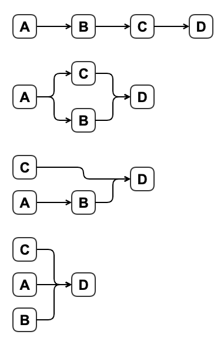

[TOC]

# Concurrency, Parallelism, Synchronous, Asynchronous and all that Jazz

Terms that will be covered in this document:
* concurrency
* parallelism
* threading
* multiprocessing
* asyncronous
* syncronous
* processes
* threads
* multithreading


**What is typically left out of the conversation/explanations regarding these concepts?**
* You are coming to these concepts with a the implementation of a solution whose structure *is inherently asyncronous*,
  therefore it is difficult to differentiate what *isn't* asyncronous.

so lets zoom out...

# Problems Domain/Space & Solution Domain/Space

Problems are not inherently concurrent, parallel, syncronous or asyncronous.

* Problems...:
    * ...have *definitions*.
    * ...have multiple solutions (some more efficient than others).
* Solutions...:
    * ...have *structure*.
    * ...have *dimensions*.
    * ...are *implemented* with different *technologies*.
    * ...are *executed* with those technologies..

The words *"concurrent, parallel, asynchronous and synchronous"* are *descriptors of the structure or execution of a
particular solution* to a problem.

* 'Concurrent', 'asynchronous' and 'synchronous' are a descriptors of the *structure* of a particular solution.
* 'Parallel' is a descriptor of the *execution* of a particular solution.

## Examples

A problem gets broken down into tasks A, B, C and D, each of which must be completed for the problem to be completed.
* If...
    * D is dependent on C...
    * C is dependent on B...
    * and B is dependent on A...
  then *the structure of the solution is linear, and therefore neither concurrency nor parallelism are applicable
  descriptors of this solution*.

* Examples:
    * **Chess:** A single chess match between two players. There is no way around the fact that each player must wait on
      the other player to make their next move.
    * **Medicine:** 
    * **Programming (without I/O):**
    * **Programming (with I/O):**

$$
\begin{align}
& A \\
B & = f(A) \\
C & = g(B) \\
D & = h(C)
\end{align}
$$


    # 




The question is not:
> Should the solution be asyncronous or syncronous?

The question is:

> *Which* parts of the solution can/should be asyncronous and *which* parts *must* be syncronous?


IT IS ABOUT UNDERSTANDING THE STRUCTURE OF THE SUBSOLUTION.....

Technologies are used to implement solutions. This implies that the solution exists prior to the technology


## Lenses / Perspectives

These terms are best viewed through different lenses / from different perspectives. The following is a list of the the
lenses through which we will look at these concepts:

* Problem Domain
* Solution Domain
    * Hardware
    * Software
        * Layer 0
        * Layer 1
        * Layer 2
    * Programmer

### Viewed through the Hardware Lens

From the

### Viewed through the Programmer Lens

The key thing to understand/accept is *you are programming at a higher level of abstraction when you are programming
asyncronously.*

When programming syncronously, 


### Concepts 

Concurrency & Parallelism are concepts that exist outside the domain of software and computer science. A good way of
separating these two concepts is asking the question:

> Is waiting *on external events* an unavoidable part of the solution to a problem you are trying to solve?

The answer to this is **"yes" in a lot of situations**:
* Physical World Examples: 
    * Chess Tournaments:
        * Player A must wait for Player B to move before he can move again.
    * Baking/Cooking:
        * You must wait for the oven to preheat before you can use it
    * 
* Digital World Examples: 
    * You must wait for an API response after you have sent a request
    * You must wait for a DB to return data you queried


* **Concurrency**: *Progress* on two or more tasks is made *at the exact same time.*
    * Concurrency is about the *design/structure* of the solution
* **Parallelism**: *Actions* need to make progress on two or more tasks are *performed at the exact same time.*
    * Parallelism is about *action*


When I say "at the exact same time" I mean *at the exact same time*, the same way you can snap the fingers of both hands
*at the exact same time*.


The real questions is:

* Multiprocessing:
    * A means to implement parallelism.
    * The act of spreading operations over multiple cores on a computer
* Threading:
    * 


There are two perspectives/lenses through with we look at these terms:
* The "Problem Domain" Lens:
    * Definitions viewed through this lens:
        * Concurrency/Concurrent: **Progress** on two or more tasks is made *at the exact same time.*
* The "Solution Domain" Lens:
    * Definitions viewed through this lens:
        * Parallelism/Parallel: **Actions** need to make progress on two or more tasks are **performed** *at the exact same time.*


* All parallelism is concurrent, not all concurrency is parallelism.


## Programs, Processes & Threads

* Programs are what developers write...
    * Processes are executing instances of an application.
        * Threads are paths of execution *within* a process.

* Processes setup the resources need

# Concurrency & Parallelism Through the Lens of Music

Music domain (piano being the instrument of choice):
* notes
* chords
* piece(song)
* hand (singular)
* hands (both)
* fingers (hardware?)
* fingering

Computer Science domain:
* concurrency
* parallelism
* threading
* multiprocessing
* asyncronous I/O
* process/task/threads
* processor
* core
* hyperthreading

# Initial Guesses

* `Music Domain <--> Computer Science Domain`
* `fingers <--> cores`
* `hands <--> processor`

**<u>How to read the below table:</u>**

"`X` *is/are to the* **Music Domain** in the same way the `Y` *is/are to the* **Computer Science Domain**"

Further definitions:

* "People create programs to direct processes." - SICP
  * Addition: "People create programs *which resemble solutions to problems* to direct *computational* process"
  * Addition: "People create programs to direct *computational* process *whose outcome solves a problem*."

`Problem <--> Programs <--> Process`

`Real World <--> Programs <--> Computational World`


| `X`            | `Y`                  |
| -------------- | -------------------- |
| Pieces (songs) | Application Programs |
| Chords         | Parallelism          |
| Notes          | Concurrency          |
|                | Synchronous          |
|                | Asynchronous         |
| Fingers        | Cores                |
| Hands          | Processors           |

```python
import multiprocessing
import time
import random


def worker(number):
    sleep = random.randrange(1, 10)
    time.sleep(sleep)
    print("I am Worker {}, I slept for {} seconds".format(number, sleep))


for i in range(5):
    t = multiprocessing.Process(target=worker, args=(i,))
    t.start()


print("All Processes are queued, let's see when they finish!")
```

## Hypothesis

1. A 'problem domain process' that is inherently syncronous will still be syncronous when written with asyncronous code.

2. Not only will a 'problem domain process' that is inherently syncronous still be syncronous when written with
   asyncronous code, it will be *slower* than if it had been written with syncronous code.


```python
import asyncio

async def return_x(x):
    await asyncio.sleep(1)
    return x

async def return_y(y):
    await asyncio.sleep(1)
    return y

async def main(x, y):
    x = await return_x(x)
    y = await return_y(y)
    print(x + y)
    return x + y

if __name__ == '__main__':
    asyncio.run(main(1, 2))
```


# IDK man...

You *can* call non-async code from async code

> "Conversely you absolutely can call non-async code from async-code, in fact it’s easy to do so. But if a
> method/function call might “block” (ie. take a long time before it returns) then you really shouldn’t."
- [Part 5 Here](https://bbc.github.io/cloudfit-public-docs/)

...however, if that call that might "block" is necessary for all downstream operations, *there is no avoiding the
blocking...?*
